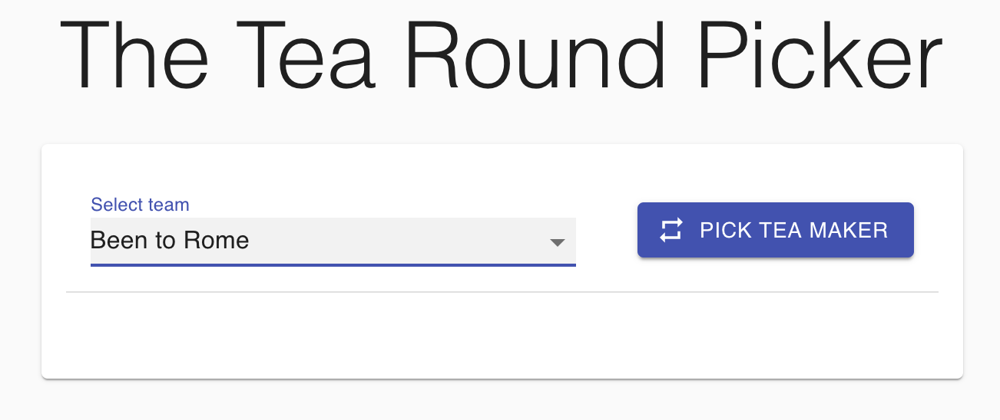

# The Tea Round Picker

The Tea Round Picker is a tool aimed to increase productivity at Lumio by helping to select the next tea maker in the fairest way

While working on this solution I was considering the following requirements:

1. Cross-platform mobile/web rendering
2. Could be converted to an iOS/Android app
3. Clean architecture by Uncle Bob
4. Concurrent access and scalability
5. REST API model
6. Best practices in DevOps / Automation - docker, build scripts (Makefile), etc
7. Solution should be easily extended in case of new requirements
8. This is a test task so some compromises have to be made
9. It should be challenging
10. It should be fun 

### Requirements

-   `docker`, `docker_compose`, `make`

-   Internet access for avatars


For running backend tests you would need to have `golang` and `golangci-lint` installed locally, then you can run

-   `make fmt` to run go formatter

-   `make lint` to run go linter

-   `make tests` to run tests

### How to run

Please see [Makefile](Makefile) for the list of available commands. To build & run please run the following command in the project root: `make build && make run`. It can take up to a few minutes, then open  http://localhost:8081 in your browser. Run `make down` to stop and remove all running docker containers.

<hr>

### How to use

It is a single-page app which could be divided into 4 "zones":

##### Employees

Add or remove Lumio employees 


<br>

##### Teams

Create as many teams as you want


<br>

##### Team members

This is a place to define teams composition


<br>

##### Tea round picker zone

Select one of the defined teams and then click on the "Pick tea maker"



<br>
<hr>

### Architecture

The solution consists of 2 parts - frontend (React) and backend (Golang). They are built and run independently using `docker`. The backend provides a simple REST API (please see [OpenAPI specification](swagger.yml)), consumed by the React app.

There is no persistent storage at the moment, all changes will be lost after restarting the backend process, however, concurrent access is supported (you can access the service from different browsers at the same time)


#### Frontend

The frontend is written in React using [Material UI](https://material-ui.com), so it follows Google's material design principles and can be easily converted to iOS/Android app. Also, it cross-platform and can be rendered both on PCs and mobile browsers. [Axios](https://github.com/axios/axios) for the HTTP communication. 

All interactions with backend happen via HTTP calls with both request and response in JSON format

#### Backend

Backend follows Clean Architecture pattern and domain-driven design. Project layout follows the idiomatic golang project structure and is organised as follows:

* `/api` provides handlers and service layers for the API endpoints

* `/pkg` library code that's ok to use by external applications

* `/internal` private application and library code

* `/cmd` main application


It is worth to mention that all entities have UUIDs as their IDs


#### Fair algorithm for choosing the next tea maker

[Current implementation](internal/pick/randomStrategy.go) uses a random selection among the team members. The strategy pattern is used to provide it as a [dependency](pkg/pick/strategy.go) so it is quite straightforward to change the code and provide any other algorithm.

### Limitations

Due to the nature of the task some compromises / limitations were made:

-   Response structure does not include any error flags, which normally would be there, for example:
    ```json
    {
        "error_code: int32,
        "error_msg": string,
        "data": {
          ...
        }
    }
    ```
    
-   Test coverage should be much higher

-   Service is stateless, however dues to the clean architecture/modular approach it is quite easy to write an actual storage layer

-   Not enough validations or error checks, normally you don't trust client's data

-   No dependency injection - all dependencies are set up manually, normally there should be a dependency manager

-   More powerful tool should be used for mocking in tests (instead of the standard approach)
